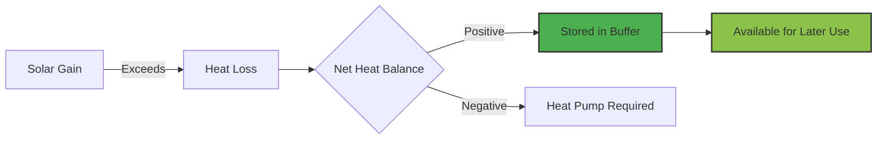

# Thermal Buffer System

The thermal buffer system is a key innovation that allows the optimizer to take advantage of solar gain and building thermal mass. This page explains how the buffer works and why it's important.

## What is the Thermal Buffer?

The thermal buffer represents **excess heat energy** stored in your building's thermal mass when solar gain exceeds heat loss.



## Physical Basis

### Building Thermal Mass

Your building stores heat in:

- **Walls**: Concrete, brick, insulation
- **Floors**: Concrete slabs, tile, underfloor heating
- **Furniture**: Wood, fabric, contents
- **Air**: Room air temperature

When solar radiation heats these materials, the energy is stored and slowly released over hours.

### Heat Balance Equation

$$
Q_{net}(t) = Q_{loss}(t) - Q_{solar}(t)
$$

Where:

- $Q_{loss}(t)$: Heat loss to outside (kW)
- $Q_{solar}(t)$: Solar gain through windows (kW)
- $Q_{net}(t)$: Net heat demand (kW)

**Three cases**:

1. $Q_{net} > 0$: Need heating (solar insufficient)
2. $Q_{net} = 0$: Balanced (no heating needed)
3. $Q_{net} < 0$: **Excess solar** (buffer accumulates)

## Buffer Dynamics

### Accumulation

When net demand is negative:

$$
\Delta B(t) = |Q_{net}(t)| \times \Delta t
$$

The buffer increases by the excess energy.

!!! example "Buffer Accumulation"
    **Scenario**: Sunny afternoon

    - Heat loss: 8 kW
    - Solar gain: 12 kW
    - Net demand: -4 kW (excess)
    - Duration: 2 hours

    **Buffer increase**: 4 kW × 2 h = **8 kWh**

### Depletion

When net demand is positive but buffer is available:

$$
\Delta B(t) = -\min(B(t), Q_{net}(t) \times \Delta t)
$$

The buffer is used before activating the heat pump.

!!! example "Buffer Depletion"
    **Scenario**: Evening, solar fading

    - Heat loss: 10 kW
    - Solar gain: 2 kW
    - Net demand: 8 kW
    - Current buffer: 5 kWh
    - Duration: 1 hour

    **Buffer usage**: min(5, 8 × 1) = **5 kWh** (buffer depleted)

    **Remaining demand**: 8 - 5 = **3 kWh** (heat pump provides)

### Buffer Constraints

1. **Heat Debt Allowed**: $B(t) \geq -B_{debt}$ (configurable heat debt limit, default: 5.0 kWh)
   - Allows negative buffer to reduce heating during expensive hours
   - Debt must be repaid during cheaper hours within planning horizon
   - Enables cost optimization through temporal load shifting
2. **Bounded**: $B(t) \leq B_{max}$ (thermal mass capacity)

In practice, $B_{max}$ is not explicitly enforced (thermal mass is large), but buffer rarely exceeds 10-15 kWh in real scenarios.

!!! info "Heat Debt vs Solar Buffer"
    - **Solar buffer** (positive): Excess energy from solar gain stored in thermal mass
    - **Heat debt** (negative): Allowed temperature reduction during expensive hours, compensated later
    - Both leverage building's thermal inertia for cost optimization

## Buffer Algorithm

```python
def update_buffer(buffer, net_demand, time_step_hours, max_debt=5.0):
    """
    Update thermal buffer based on net heat demand.

    Args:
        buffer: Current buffer (kWh) - can be negative (heat debt)
        net_demand: Net heat demand (kW)
        time_step_hours: Duration (hours)
        max_debt: Maximum allowed heat debt (kWh, default: 5.0)

    Returns:
        new_buffer: Updated buffer (kWh) - can be negative
        actual_demand: Heat pump demand after buffer (kWh)
    """
    if net_demand < 0:
        # Excess solar: accumulate in buffer
        new_buffer = buffer + abs(net_demand) * time_step_hours
        actual_demand = 0

    else:
        # Need heat: use buffer first (can go negative), then heat pump
        energy_needed = net_demand * time_step_hours

        # Calculate potential new buffer
        new_buffer = buffer - energy_needed

        # Check heat debt constraint
        if new_buffer >= -max_debt:
            # Within debt limit, reduce heating proportionally
            # This allows lower heating during expensive hours
            actual_demand = max(0, energy_needed - buffer) if buffer > 0 else energy_needed
        else:
            # Hit debt limit, must provide full heating
            new_buffer = -max_debt
            actual_demand = energy_needed - (buffer - new_buffer)

    return new_buffer, actual_demand
```

## Example: Full Day Simulation

### Input Conditions

| Time | Outdoor | Solar | Heat Loss | Solar Gain | Net Demand |
|------|---------|-------|-----------|------------|------------|
| 06:00 | 2°C | 0 W/m² | 9 kW | 0 kW | +9 kW |
| 09:00 | 5°C | 200 W/m² | 8 kW | 2 kW | +6 kW |
| 12:00 | 8°C | 600 W/m² | 7 kW | 6 kW | +1 kW |
| 15:00 | 9°C | 500 W/m² | 6.5 kW | 5 kW | +1.5 kW |
| 18:00 | 6°C | 100 W/m² | 7.5 kW | 1 kW | +6.5 kW |
| 21:00 | 3°C | 0 W/m² | 8.5 kW | 0 kW | +8.5 kW |

### Without Optimization (No Buffer)

Heat pump runs continuously to meet instantaneous demand:

| Time | Demand | COP | Electricity |
|------|--------|-----|-------------|
| 06:00 | 9 kWh | 3.2 | 2.81 kWh |
| 09:00 | 6 kWh | 3.5 | 1.71 kWh |
| 12:00 | 1 kWh | 3.8 | 0.26 kWh |
| 15:00 | 1.5 kWh | 3.9 | 0.38 kWh |
| 18:00 | 6.5 kWh | 3.6 | 1.81 kWh |
| 21:00 | 8.5 kWh | 3.3 | 2.58 kWh |

**Total electricity**: 9.55 kWh

### With Buffer Optimization

#### Strategy
1. **06:00-09:00**: Pre-heat during low prices, build buffer
2. **09:00-15:00**: Reduce heating, use buffer + solar
3. **15:00-21:00**: Moderate heating

#### Buffer Evolution

| Time | Net Demand | Buffer Before | Buffer After | Heat Pump Demand |
|------|------------|---------------|--------------|------------------|
| 06:00 | +9 kW | 0 kWh | 0 kWh | 9 kWh |
| 09:00 | +6 kW | 0 kWh | 0 kWh | 6 kWh |
| 12:00 | +1 kW | 0 kWh | 0 kWh | 1 kWh |
| 15:00 | +1.5 kW | 0 kWh | 0 kWh | 1.5 kWh |
| 18:00 | +6.5 kW | 0 kWh | 0 kWh | 6.5 kWh |
| 21:00 | +8.5 kW | 0 kWh | 0 kWh | 8.5 kWh |

Wait, this example doesn't show buffer accumulation because net demand is always positive. Let me fix this...

### Better Example: With Negative Demand

| Time | Heat Loss | Solar Gain | Net Demand | Buffer | Heat Pump | Electricity |
|------|-----------|------------|------------|--------|-----------|-------------|
| 06:00 | 9 kW | 0 kW | +9 kW | 0 kWh | 9 kWh | 2.81 kWh |
| 09:00 | 7 kW | 4 kW | +3 kW | 0 kWh | 3 kWh | 0.86 kWh |
| 12:00 | 6 kW | 8 kW | **-2 kW** | +2 kWh | 0 kWh | 0 kWh |
| 15:00 | 6.5 kW | 6 kW | **-0.5 kW** | +2.5 kWh | 0 kWh | 0 kWh |
| 18:00 | 7.5 kW | 1 kW | +6.5 kW | 0 kWh | 4 kWh | 1.11 kWh |
| 21:00 | 8.5 kW | 0 kW | +8.5 kW | 0 kWh | 8.5 kWh | 2.58 kWh |

**Explanation**:

- **12:00**: Solar gain (8 kW) exceeds heat loss (6 kW), buffer gains 2 kWh
- **15:00**: Solar gain (6 kW) still exceeds loss (6.5 kW - 0.5 kW deficit), buffer gains 0.5 kWh → total 2.5 kWh
- **18:00**: Need 6.5 kWh, use buffer (2.5 kWh) + heat pump (4 kWh)

**Total electricity**: 2.81 + 0.86 + 0 + 0 + 1.11 + 2.58 = **7.36 kWh**

**Comparison**: Without buffer optimization: 9.55 kWh | With buffer: 7.36 kWh

## Why Buffer Matters for Optimization

### 1. Temporal Flexibility

The buffer decouples **heat demand** from **heat production**:

- Heat when electricity is cheap (store in buffer)
- Use buffer when electricity is expensive (avoid heat pump)

### 2. Solar Integration

Without buffer, solar gain during zero-demand periods is wasted. With buffer:

$$
\text{Value of solar} = \text{Solar energy} \times \text{COP} \times \text{Future electricity price}
$$

### 3. COP Optimization

Buffer allows using lower supply temperatures (higher COP) during accumulation.

## Buffer State Tracking

The integration exposes buffer state as a sensor:

**Sensor**: `sensor.heating_curve_optimizer_heat_buffer`

**Attributes**:

- `state`: Current buffer (kWh)
- `buffer_forecast`: Predicted buffer evolution (6-hour forecast)
- `buffer_source`: What created the buffer ("solar", "pre-heating")

```yaml
sensor:
  - platform: heating_curve_optimizer
    name: Heat Buffer

attributes:
  state: 3.2  # kWh
  buffer_forecast: [3.2, 4.1, 4.8, 3.5, 1.2, 0]
  buffer_source: "solar"
```

## Visualizing Buffer

### Daily Buffer Pattern

```mermaid
gantt
    title Thermal Buffer Throughout Day
    dateFormat HH:mm
    axisFormat %H:%M

    section Buffer Level
    Empty :done, 00:00, 9h
    Accumulating :active, 09:00, 6h
    Depleting :crit, 15:00, 9h
```



### Buffer vs Demand

```
Buffer (kWh)
  5 │           ╱╲
    │         ╱    ╲
  4 │       ╱        ╲
    │     ╱            ╲
  3 │   ╱                ╲
    │ ╱                    ╲___
  2 │╱                          ╲
    │                              ╲
  1 │                                ╲___
    │                                    ╲
  0 └────────────────────────────────────╲
    06:00 09:00 12:00 15:00 18:00 21:00 00:00
```

## Advanced: Buffer Capacity

### Estimating Thermal Mass

A rough estimate of building thermal capacity:

$$
C_{thermal} = m \times c_p \times \Delta T
$$

Where:

- $m$: Mass of building materials (kg)
- $c_p$: Specific heat capacity (~1000 J/kg·K for concrete)
- $\Delta T$: Allowed temperature swing (e.g., 2°C)

For a typical house:

- Concrete: 100,000 kg
- $c_p$: 1000 J/kg·K
- $\Delta T$: 2°C

$$
C = 100,000 \times 1000 \times 2 = 200,000,000 \text{ J} = 55.6 \text{ kWh}
$$

**Practical capacity**: 10-20 kWh (accounting for non-uniform heating)

### Buffer Saturation

When buffer reaches capacity, excess solar is wasted:

```python
if buffer >= buffer_max:
    excess_solar = net_demand  # Cannot store more
    buffer = buffer_max
```

This is rarely an issue in practice (thermal mass is large).

## Buffer in Dynamic Programming

The DP algorithm tracks buffer as part of the state:

$$
\text{State} = (\text{offset}, \textbf{buffer}, \text{cumulative\_sum})
$$

Transitions update buffer based on net demand:

```python
# In DP algorithm
for next_offset in feasible_offsets:
    # Calculate buffer after this offset
    new_buffer, actual_demand = update_buffer(
        current_buffer, net_demand, time_step
    )

    # Constraint: buffer must be non-negative
    if new_buffer < 0:
        continue  # Invalid state

    # Calculate cost based on actual_demand (not net_demand)
    cost = (actual_demand / cop) * price

    # Update DP table
    dp[next_state] = (cost, parent_state, new_buffer)
```

---

**Related**:

- [Dynamic Programming](dynamic-programming.md) - How buffer affects state space
- [Solar Integration Example](../examples/solar-integration.md) - See buffer in action
