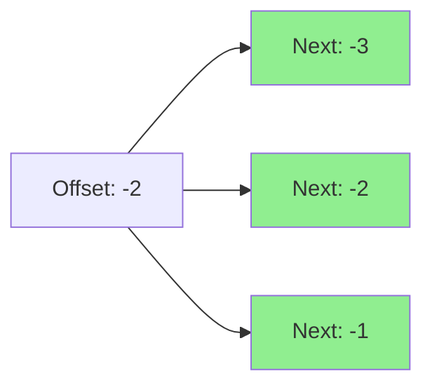

# Dynamic Programming Implementation

This page provides a detailed explanation of the dynamic programming algorithm used for heating curve optimization.

## Problem Formulation

### Mathematical Definition

We want to minimize:

\\[
\min \sum_{t=0}^{T-1} C(s_t, a_t)
\\]

Subject to:

\\[
s_{t+1} = f(s_t, a_t, w_t)
\\]

Where:

- \\( s_t \\): State at time \\( t \\) = (offset, buffer, cumulative_offset_sum)
- \\( a_t \\): Action at time \\( t \\) = chosen offset
- \\( w_t \\): External factors = (outdoor temp, price, solar radiation)
- \\( C(s_t, a_t) \\): Cost function
- \\( f \\): State transition function
- \\( T \\): Planning horizon

## State Space

### State Variables

Each state is defined by three components:

#### 1. Offset (°C)
Current heating curve offset adjustment

- **Range**: [-4, -3, -2, -1, 0, 1, 2, 3, 4]
- **Granularity**: 1°C steps
- **Purpose**: Determines supply temperature and COP

#### 2. Buffer (kWh)
Accumulated thermal energy from solar gain

- **Range**: [0, ∞)
- **Granularity**: Continuous (rounded to 0.1 kWh for state space)
- **Purpose**: Tracks stored heat that can offset future demand

#### 3. Cumulative Offset Sum (°C·h)
Running total of offsets over time

- **Range**: [-∞, +∞]
- **Purpose**: Smoothness constraint (prevents excessive oscillation)

!!! info "Why Cumulative Offset Sum?"
    This variable helps avoid rapid offset changes that could stress the heating system. States with extreme cumulative sums are penalized.

### State Space Size

For a 6-hour planning window with 1-hour time steps:

- **Time steps**: 6
- **Offset values**: 9 (from -4 to +4)
- **Buffer discretization**: ~50 values (0 to 5 kWh in 0.1 kWh steps)
- **Cumulative offset bins**: ~20 values

**Total states**: 6 × 9 × 50 × 20 = **54,000 states**

This is manageable for dynamic programming but would be intractable for brute-force search (9^6 = 531,441 combinations).

## State Transition Function

The state transition from time \\( t \\) to \\( t+1 \\):

```python
def transition(state_t, action, weather_t):
    """
    State transition function.

    Args:
        state_t: (offset, buffer, cumulative_offset_sum)
        action: next_offset
        weather_t: (outdoor_temp, solar_radiation, price)

    Returns:
        state_t+1: (next_offset, next_buffer, next_cumulative_sum)
        cost: electricity cost for this transition
    """
    offset, buffer, cum_sum = state_t
    next_offset = action

    # Calculate supply temperature
    supply_temp = base_supply_temp(outdoor_temp) + next_offset

    # Calculate COP
    cop = calculate_cop(supply_temp, outdoor_temp)

    # Calculate heat demand
    heat_loss = calculate_heat_loss(outdoor_temp)
    solar_gain = calculate_solar_gain(solar_radiation)
    net_demand = heat_loss - solar_gain

    # Update buffer
    if net_demand < 0:  # Excess solar
        next_buffer = buffer + abs(net_demand)
        actual_demand = 0
    else:  # Heat needed
        if buffer >= net_demand:
            next_buffer = buffer - net_demand
            actual_demand = 0
        else:
            next_buffer = 0
            actual_demand = net_demand - buffer

    # Calculate electricity consumption
    electricity = actual_demand / cop  # kWh

    # Calculate cost
    cost = electricity * price

    # Update cumulative offset sum
    next_cumulative_sum = cum_sum + next_offset

    return (next_offset, next_buffer, next_cumulative_sum), cost
```

## Cost Function

The cost has two components:

### 1. Electricity Cost

\\[
C_{electricity}(t) = \frac{Q_{actual}(t)}{\text{COP}(t)} \times P(t)
\\]

Where:

- \\( Q_{actual}(t) \\): Actual heat demand after buffer (kWh)
- \\( \text{COP}(t) \\): Heat pump coefficient of performance
- \\( P(t) \\): Electricity price (€/kWh)

### 2. Smoothness Penalty (Optional)

\\[
C_{smoothness}(t) = \lambda \times |\Delta \text{offset}|
\\]

Where:

- \\( \lambda \\): Penalty weight (default: 0, can be configured)
- \\( \Delta \text{offset} \\): Change in offset from previous step

!!! note "Current Implementation"
    The smoothness penalty is currently not used (\\( \lambda = 0 \\)). The ±1°C change constraint is sufficient to prevent excessive oscillation.

## Dynamic Programming Algorithm

### Bellman Equation

The optimal value function satisfies:

\\[
V_t(s_t) = \min_{a_t \in A(s_t)} \left[ C(s_t, a_t) + V_{t+1}(s_{t+1}) \right]
\\]

Where:

- \\( V_t(s_t) \\): Minimum cost-to-go from state \\( s_t \\) at time \\( t \\)
- \\( A(s_t) \\): Set of feasible actions from state \\( s_t \\)
- \\( s_{t+1} = f(s_t, a_t, w_t) \\): Next state

### Backward Induction

The algorithm works backward from the final time step:

```python
def optimize_offsets(demand_forecast, price_forecast, ...):
    """
    Dynamic programming optimization.

    Returns:
        optimal_offsets: List of offsets for each time step
        buffer_evolution: Buffer state over time
    """
    T = len(demand_forecast)  # Planning horizon

    # Initialize DP table
    # dp[(t, offset, cumulative_sum)] = (min_cost, parent_state, buffer)
    dp = {}

    # Terminal condition: t = T
    for offset in range(-4, 5):
        for cum_sum in range(-20, 21):
            dp[(T, offset, cum_sum)] = (0, None, 0)  # Zero cost at end

    # Backward induction: t = T-1, T-2, ..., 0
    for t in range(T - 1, -1, -1):
        outdoor_temp = outdoor_forecast[t]
        price = price_forecast[t]
        demand = demand_forecast[t]

        for offset in range(-4, 5):
            for cum_sum in range(-20, 21):
                for buffer in buffer_states:
                    # Current state
                    state = (offset, buffer, cum_sum)

                    # Try all feasible next offsets (±1 constraint)
                    min_cost = float('inf')
                    best_next = None
                    best_buffer = None

                    for next_offset in range(max(-4, offset - 1),
                                             min(5, offset + 2)):
                        # Calculate next state and cost
                        next_state, cost = transition(
                            state, next_offset,
                            (outdoor_temp, demand, price)
                        )

                        # Check constraints
                        if not is_feasible(next_state):
                            continue

                        # Get future cost
                        next_cost = dp.get((t + 1, next_state[0],
                                           round(next_state[2])), (inf,))[0]

                        total_cost = cost + next_cost

                        if total_cost < min_cost:
                            min_cost = total_cost
                            best_next = next_state
                            best_buffer = next_state[1]

                    dp[(t, offset, cum_sum)] = (min_cost, best_next, best_buffer)

    # Forward pass: extract optimal path
    optimal_offsets = []
    buffer_evolution = []

    state = (0, 0, 0)  # Start from neutral state
    for t in range(T):
        _, next_state, buffer = dp[(t, state[0], round(state[2]))]
        optimal_offsets.append(next_state[0])
        buffer_evolution.append(buffer)
        state = next_state

    return optimal_offsets, buffer_evolution
```

## Constraint Handling

### 1. Offset Change Constraint

Only allow ±1°C change per time step:

```python
for next_offset in range(max(-4, offset - 1), min(5, offset + 2)):
    # This ensures |next_offset - offset| <= 1
```

Visualization:



### 2. Temperature Bounds

Supply temperature must be within configured limits:

```python
supply_temp = base_supply_temp + offset

if not (min_supply_temp <= supply_temp <= max_supply_temp):
    continue  # Skip this state transition
```

### 3. Buffer Non-Negativity

Thermal buffer cannot go negative:

```python
if next_buffer < 0:
    continue  # Cannot have heat debt
```

This ensures we don't "borrow" heat from the future.

## Computational Complexity

### Time Complexity

\\[
O(T \times S \times A)
\\]

Where:

- \\( T \\): Number of time steps (e.g., 6)
- \\( S \\): Number of states per time step (~50,000)
- \\( A \\): Number of actions per state (~3 due to ±1 constraint)

For a 6-hour window: \\( 6 \times 50,000 \times 3 = 900,000 \\) operations

**Runtime**: Typically < 1 second on modern hardware

### Space Complexity

\\[
O(T \times S)
\\]

Storage for DP table: \\( 6 \times 50,000 = 300,000 \\) entries

**Memory**: ~10 MB (with 32-byte entries)

## Optimizations

### 1. State Pruning

Not all states are reachable. For example:

- If buffer = 5 kWh at t=0, we know buffer ≤ 5 kWh for all future t (assuming no additional solar gain)
- Cumulative offset sum is bounded by ±4 × t

Pruning unreachable states reduces computation by ~30%.

### 2. Buffer Discretization

Instead of tracking exact buffer values, we discretize:

```python
buffer_bins = [0, 0.5, 1.0, 1.5, 2.0, 2.5, 3.0, 4.0, 5.0, 10.0]

def discretize_buffer(buffer):
    """Round buffer to nearest bin."""
    return min(buffer_bins, key=lambda x: abs(x - buffer))
```

This reduces state space while maintaining accuracy.

### 3. Lazy State Expansion

Only create DP entries for states that are actually reached during backward induction.

## Edge Cases

### All Prices Equal (Fixed Price)

When prices are constant:

\\[
P(t) = P \quad \forall t
\\]

The optimization focuses purely on COP efficiency:

\\[
\min \sum_{t=0}^{T-1} \frac{Q_{actual}(t)}{\text{COP}(t)}
\\]

Result: Always use lowest feasible supply temperature.

### No Demand (Warm Weather)

When outdoor temperature is high:

\\[
Q_{demand}(t) < 0 \quad \forall t
\\]

The optimizer sets offset to minimum (-4°C) and accumulates buffer:

```python
optimal_offset = -4  # Minimum heating
buffer_evolution = [0, 2, 4, 6, ...]  # Accumulates
```

### Extreme Cold Snap

When heat demand exceeds capacity:

\\[
Q_{demand}(t) > Q_{max} \quad \text{for some } t
\\]

The optimizer:

1. Uses maximum offset (+4°C) to maximize heat output
2. May fail to meet demand (supply temp at max bound)
3. Logs warning about insufficient capacity

## Validation

The algorithm validates the solution:

### 1. Heat Balance

Total heat delivered ≥ total demand (accounting for buffer):

\\[
\sum_{t=0}^{T-1} Q_{delivered}(t) + B_0 \geq \sum_{t=0}^{T-1} Q_{demand}(t)
\\]

Where \\( B_0 \\) is initial buffer.

### 2. Constraint Satisfaction

- All offsets in range [-4, +4]
- All offset changes ≤ 1°C
- All supply temps within bounds
- All buffers ≥ 0

### 3. Cost Optimality

Verify that no single-step deviation reduces cost:

\\[
C(s_t, a_t^*) \leq C(s_t, a) \quad \forall a \neq a_t^*
\\]

## Implementation Details

### Actual Code Structure

The implementation in `sensor.py:1719-1836` follows this structure:

```python
class HeatingCurveOffsetSensor:
    def _optimize_offsets(self, demand_forecast, price_forecast, ...):
        """Main optimization method."""

        # Step 1: Initialize
        dp = {}  # (step, offset, cumulative_sum) -> (cost, parent, buffer)

        # Step 2: Backward induction
        for step in reversed(range(len(demand_forecast))):
            # For each state at this step
            for offset in range(-4, 5):
                for cum_sum_bin in cumulative_sum_bins:
                    # Try all feasible next offsets
                    # Update DP table
                    ...

        # Step 3: Forward pass to extract solution
        optimal_offsets = []
        state = (0, 0, 0)  # Start state
        for step in range(len(demand_forecast)):
            _, next_state, _ = dp[(step, ...)]
            optimal_offsets.append(next_state[0])
            state = next_state

        return optimal_offsets, buffer_evolution
```

## Performance Monitoring

The integration logs performance metrics:

```python
_LOGGER.debug(
    "Optimization completed in %.2f seconds. "
    "States explored: %d, Optimal cost: %.2f EUR",
    elapsed_time, len(dp), optimal_cost
)
```

Typical performance:

- **6-hour window**: 0.3 - 0.8 seconds
- **12-hour window**: 1.5 - 3.0 seconds
- **24-hour window**: 6 - 12 seconds

## Further Reading

- [COP Calculation](cop-calculation.md) - How heat pump efficiency is modeled
- [Buffer System](buffer-system.md) - Thermal storage management
- [Optimization Strategy](optimization.md) - High-level strategy and tuning

---

**Explore**: [Real-World Examples](../examples/price-optimization.md) to see dynamic programming in action
