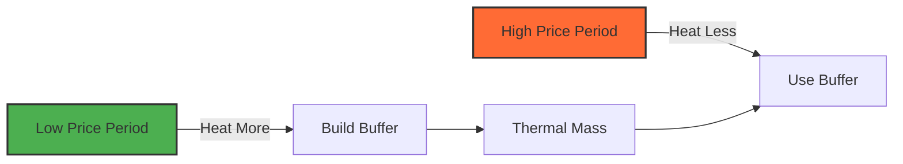

# Optimization Strategy

This page explains the high-level optimization strategy and how to tune the optimizer for your specific situation.

## Optimization Objectives

The integration optimizes a **multi-objective problem** with the following goals:

### Primary Objective: Minimize Cost

\\[
\min \sum_{t=0}^{T-1} \frac{Q_{actual}(t)}{\text{COP}(t)} \times P(t)
\\]

Minimize total electricity cost while meeting heat demand.

### Constraints

1. **Heat balance**: All heat demand must be satisfied (or buffered)
2. **Temperature bounds**: Supply temperature within limits
3. **Rate limits**: Maximum ±1°C offset change per hour
4. **Physical limits**: Buffer cannot be negative

### Implicit Objectives

- **Comfort**: Maintained by temperature bounds
- **System longevity**: Protected by rate limits
- **Efficiency**: Naturally optimized by COP model

## Optimization Strategies

### 1. Temporal Shifting

**Concept**: Heat when electricity is cheap, use building thermal mass during expensive periods.

**Mechanism**:

- Pre-heat during low-price periods (+offset)
- Coast during high-price periods (-offset)
- Buffer stores excess heat for later use

**Effectiveness**:

- High with dynamic pricing (10-30% savings)
- Minimal with fixed pricing (2-5% savings)



### 2. COP Optimization

**Concept**: Use lower supply temperatures (higher COP) when possible.

**Mechanism**:

- Lower offset → Lower supply temp → Higher COP → Less electricity
- Trade-off: Less heat output vs. better efficiency

**Effectiveness**:

- Moderate (5-10% improvement)
- Works even with fixed pricing

**Example**:

| Supply Temp | COP | Heat (kW) | Electricity (kW) |
|-------------|-----|-----------|------------------|
| 40°C | 3.5 | 10 | 2.86 |
| 35°C | 3.9 | 8 | 2.05 |

Lower temp uses less electricity despite COP gain.

### 3. Solar Integration

**Concept**: Time heating to coincide with solar production and gain.

**Mechanism**:

- Reduce heating during solar gain (natural warming)
- If production > consumption, heat during excess (self-consumption)
- Buffer accumulates from both solar gain and pre-heating

**Effectiveness**:

- Very high with solar (30-70% on optimal days)
- Seasonal (best in spring/fall)

### 4. Predictive Buffering

**Concept**: Build buffer in anticipation of high prices or low temperatures.

**Mechanism**:

- Forecast identifies expensive periods
- Pre-heat before expensive periods
- Buffer carries through expensive period

**Effectiveness**:

- Depends on forecast accuracy (good with day-ahead pricing)
- Limited by buffer capacity (thermal mass)

## Trade-offs and Balancing

### COP vs. Timing

The optimizer must balance:

- **High COP** (low supply temp, low offset) → efficient but may occur during expensive period
- **Low COP** (high supply temp, high offset) → inefficient but during cheap period

**Decision factor**:

\\[
\frac{\text{Price}_{\text{cheap}}}{\text{Price}_{\text{expensive}}} \quad \text{vs} \quad \frac{\text{COP}_{\text{low-temp}}}{\text{COP}_{\text{high-temp}}}
\\]

If price ratio > COP ratio → favor timing over efficiency

**Example**:

- Cheap period: €0.15/kWh at COP 3.5 (40°C)
- Expensive period: €0.40/kWh at COP 4.0 (35°C)

Cheap cost: €0.15 / 3.5 = €0.043/kWh_heat

Expensive cost: €0.40 / 4.0 = €0.100/kWh_heat

**Verdict**: Heat during cheap period (2.3× lower cost per heat)

### Comfort vs. Cost

While minimizing cost, the optimizer respects comfort:

- **Temperature bounds**: Prevent too-cold or too-hot supply temps
- **Rate limits**: Avoid rapid temperature swings
- **Buffer limits**: Never borrow heat from future (buffer ≥ 0)

These constraints may prevent reaching absolute minimum cost, but ensure comfort is maintained.

### Forecast Horizon vs. Computation

Longer planning windows allow better optimization but increase computation:

| Planning Window | States Explored | Computation Time | Benefit |
|-----------------|-----------------|------------------|---------|
| 3 hours | ~25,000 | 0.2 sec | Basic |
| 6 hours (default) | ~50,000 | 0.5 sec | Good balance |
| 12 hours | ~100,000 | 2.0 sec | Better optimization |
| 24 hours | ~200,000 | 8.0 sec | Maximum foresight |

**Recommendation**: 6 hours is optimal for most users

## Tuning Parameters

### 1. Planning Window

**Location**: Configuration → Advanced Settings

**Default**: 6 hours

**Recommendations**:

- **3-4 hours**: Low-power devices, simpler scenarios
- **6 hours**: Default, good balance
- **12 hours**: High price volatility, predictable patterns
- **24 hours**: Maximum optimization, powerful hardware

### 2. Time Base

**Location**: Configuration → Advanced Settings

**Default**: 60 minutes

**Recommendations**:

- **60 minutes**: Default, matches hourly pricing
- **30 minutes**: Half-hourly pricing markets
- **15 minutes**: Expert users, high-resolution control

!!! warning "Computation Impact"
    Smaller time base increases computation exponentially:

    6 hours / 15 min = 24 steps (vs 6 steps at 60 min)

### 3. Temperature Bounds

**Location**: Number entities

**Defaults**:

- Min supply temp: 25°C
- Max supply temp: 50°C

**Tuning**:

- **Tighter bounds** (e.g., 30-45°C): Less optimization flexibility, more comfort
- **Wider bounds** (e.g., 25-55°C): More optimization flexibility, verify heat pump supports range

### 4. K-Factor Calibration

**Impact**: Directly affects COP predictions and optimization aggressiveness

**Calibration process**:

1. Monitor actual heat pump COP at different supply temps
2. Plot COP vs. supply temp
3. Calculate slope: k ≈ ΔCOP / ΔT_supply
4. Adjust in configuration

**Example**:

| Supply Temp | Measured COP | Theoretical COP (k=0.03) | Error |
|-------------|--------------|--------------------------|-------|
| 35°C | 4.2 | 4.2 | 0% |
| 40°C | 3.7 | 4.05 | +9% |
| 45°C | 3.2 | 3.9 | +22% |

K-factor too low → increase to 0.04

Re-test:

| Supply Temp | Measured COP | Theoretical COP (k=0.04) | Error |
|-------------|--------------|--------------------------|-------|
| 35°C | 4.2 | 4.2 | 0% |
| 40°C | 3.7 | 3.8 | +3% |
| 45°C | 3.2 | 3.4 | +6% |

Much better!

### 5. COP Compensation Factor

**Impact**: Overall scaling of efficiency predictions

**Calibration**:

1. Measure total electricity consumption over 24 hours
2. Measure total heat delivered (or calculate from degree-days)
3. Calculate actual system COP = heat / electricity
4. Compare to theoretical COP from model
5. Adjust compensation factor

**Example**:

- Theoretical average COP: 3.8
- Measured system COP: 3.4
- Compensation factor: 3.4 / 3.8 = **0.89**

## Advanced Optimization Techniques

### 1. Price Forecast Extrapolation

When next-day prices are unavailable, the integration:

1. Uses current price as constant forecast
2. Applies historical volatility patterns (if configured)
3. Falls back to COP-only optimization

### 2. Weather Forecast Refinement

The integration fetches weather from open-meteo.com:

- Updates every 5 minutes
- Uses 24-hour forecast
- Automatically adjusts for forecast errors (via re-optimization)

### 3. Adaptive Buffer Management

Buffer capacity is not explicitly limited, but the optimizer:

- Tracks buffer evolution in state space
- Prevents negative buffer (cannot borrow heat)
- Naturally saturates when thermal mass is full

### 4. Constraint Relaxation (Future Feature)

Currently under consideration:

- **Soft temperature bounds**: Violate bounds with penalty
- **Variable rate limits**: Allow faster changes during emergencies
- **Demand response**: Reduce heating during grid stress

## Optimization Performance Metrics

The integration exposes several metrics to monitor optimization quality:

### 1. Diagnostics Sensor

`sensor.heating_curve_optimizer_diagnostics`

Attributes include:

- `optimization_time_ms`: How long optimization took
- `states_explored`: Number of DP states
- `optimal_cost`: Predicted cost for planning window
- `buffer_peak`: Maximum buffer in forecast

### 2. COP Efficiency Delta

`sensor.heating_curve_optimizer_cop_efficiency_delta`

Shows COP improvement from optimization:

\\[
\Delta \text{COP} = \text{COP}_{\text{optimized}} - \text{COP}_{\text{baseline}}
\\]

Positive values indicate efficiency gains.

### 3. Heat Generation Delta

`sensor.heating_curve_optimizer_heat_generation_delta`

Shows heat output difference:

\\[
\Delta Q = Q_{\text{optimized}} - Q_{\text{baseline}}
\\]

## Real-World Optimization Patterns

### Pattern 1: Morning Pre-Heat

```
Offset
  +4 │ ╱╲
     │╱  ╲___
   0 │        ╲___
     │            ╲___
  -4 │                ╲___
     └───────────────────────
      06  09  12  15  18  Time

Price
High │        ████████
     │    ████        ████
Low  │████                ████
     └───────────────────────
      06  09  12  15  18  Time
```

**Strategy**: Pre-heat during low morning prices, coast during high midday prices

### Pattern 2: Solar Sync

```
Offset
  +4 │
     │
   0 │╲___
     │    ╲___________╱╲
  -4 │        ▼
     └───────────────────────
      06  09  12  15  18  Time

Solar
High │        ╱╲
     │      ╱    ╲
Low  │___╱          ╲___
     └───────────────────────
      06  09  12  15  18  Time
```

**Strategy**: Reduce heating during solar peak, resume as solar fades

### Pattern 3: Cold Snap Response

```
Offset
  +4 │██████████████████
     │
   0 │
     │
  -4 │
     └───────────────────────
      00  06  12  18  24  Time

Temp
 10°│
   0│
 -10│___________________
     └───────────────────────
      00  06  12  18  24  Time
```

**Strategy**: Maximum offset throughout extreme cold (optimization limited by capacity)

## Troubleshooting Poor Optimization

### Symptom: Offset Always Zero

**Causes**:

- No price forecast available
- All prices equal (fixed pricing)
- Very cold weather (at capacity limits)

**Solutions**:

- Verify price sensor has forecast attributes
- Consider dynamic pricing contract
- Accept limited optimization in extreme weather

### Symptom: Excessive Offset Changes

**Causes**:

- Incorrect k-factor (too low)
- No rate limiting (shouldn't happen)
- Buggy price forecast

**Solutions**:

- Increase k-factor
- Check price sensor data quality
- Enable rate limiting (should be default)

### Symptom: High Buffer, No Utilization

**Causes**:

- Offset constraints too tight
- Min supply temp too high
- Optimization not accounting for buffer

**Solutions**:

- Lower min supply temp (e.g., 25°C instead of 35°C)
- Widen offset range
- Check diagnostics for buffer tracking

---

**Related**:

- [Dynamic Programming](dynamic-programming.md) - Algorithm internals
- [COP Calculation](cop-calculation.md) - Efficiency modeling
- [Buffer System](buffer-system.md) - Thermal storage
