# Algorithm Overview

The Heating Curve Optimizer uses a sophisticated **dynamic programming** approach to minimize electricity costs while meeting your home's heat demand. This page provides a high-level overview of the optimization algorithm.

## The Optimization Problem

At its core, we're solving this problem:

!!! question "Optimization Goal"
    **Minimize**: Total electricity cost over the planning horizon

    **Subject to**:

    - Heat demand must be satisfied (or buffered for later)
    - Supply temperature stays within bounds
    - Offset changes are limited (±1°C per time step)
    - Thermal buffer cannot go negative

## Key Concepts

### 1. Heat Demand

Heat demand varies with weather:

\\[
Q_{demand}(t) = Q_{loss}(t) - Q_{solar}(t)
\\]

Where:

- \\( Q_{loss}(t) \\) = Heat loss due to temperature difference
- \\( Q_{solar}(t) \\) = Solar gain through windows

!!! info "Negative Demand"
    When \\( Q_{solar} > Q_{loss} \\), demand is **negative**, meaning solar gain exceeds heat loss. This excess heat is stored in the building's thermal mass as a **buffer**.

### 2. Heating Curve Offset

The heating curve offset adjusts the supply temperature:


The supply temperature is calculated as:

\\[
T_{supply} = T_{base}(T_{outdoor}) + \text{offset}
\\]

Where \\( T_{base} \\) is your heat pump's base heating curve (typically linear with outdoor temperature).

**Offset range**: -4°C to +4°C (configurable)

### 3. Heat Pump COP

The Coefficient of Performance (COP) determines how efficiently the heat pump converts electricity to heat:

\\[
\text{COP} = \left( \text{COP}_{base} + \alpha \times T_{outdoor} - k \times (T_{supply} - 35) \right) \times f
\\]

Parameters:

- \\( \text{COP}_{base} \\): Base COP at standard conditions
- \\( \alpha = 0.025 \\): Outdoor temperature coefficient
- \\( k \\): K-factor (how COP degrades with supply temp)
- \\( f \\): COP compensation factor (system efficiency)

!!! example "COP Calculation Example"
    **Given**:

    - Base COP = 3.5
    - Outdoor temp = 5°C
    - Supply temp = 40°C
    - K-factor = 0.03
    - Compensation = 0.9

    **Calculation**:
    \\[
    \text{COP} = (3.5 + 0.025 \times 5 - 0.03 \times (40 - 35)) \times 0.9
    \\]
    \\[
    = (3.5 + 0.125 - 0.15) \times 0.9 = 3.475 \times 0.9 = \mathbf{3.13}
    \\]

### 4. Electricity Cost

The cost to produce heat at time \\( t \\):

\\[
\text{Cost}(t) = \frac{Q_{heat}(t)}{\text{COP}(t)} \times P_{electricity}(t)
\\]

Where:

- \\( Q_{heat}(t) \\): Heat delivered (kWh)
- \\( \text{COP}(t) \\): Heat pump efficiency
- \\( P_{electricity}(t) \\): Electricity price (€/kWh)

!!! tip "Two Levers for Optimization"
    The optimizer can reduce costs by:

    1. **Timing**: Heat when electricity is cheap
    2. **Efficiency**: Use lower supply temps (higher COP) when possible

## Algorithm Flow


## Optimization Strategy

### Step 1: Forecast Horizon

The algorithm looks ahead for a configurable planning window (default: 6 hours).


### Step 2: State Space

For each time step, the algorithm considers:

- **Offset**: -4°C to +4°C (9 possible values)
- **Buffer**: Cumulative thermal energy stored
- **Cumulative offset sum**: Running total (for smoothness)

This creates a 3-dimensional state space.

### Step 3: Dynamic Programming

The algorithm uses **backward induction**:

1. Start from the final time step
2. For each state, calculate the minimum cost to reach the end
3. Work backward to the current time
4. Choose the path with minimum total cost


### Step 4: Constraints

The algorithm enforces several constraints:

#### Offset Change Constraint
Maximum change per time step: ±1°C

```python
# Only consider offsets within ±1 of current offset
for next_offset in range(max(-4, offset - 1), min(5, offset + 2)):
    ...
```

#### Temperature Bounds
Supply temperature must stay within configured min/max:

```python
if not (min_supply_temp <= supply_temp <= max_supply_temp):
    continue  # Skip this state
```

#### Buffer Constraint
Thermal buffer cannot go negative:

```python
if new_buffer < 0:
    continue  # Cannot have "heat debt"
```

## Output

The optimization produces:

### Primary Output
**Optimal Heating Curve Offset** for the current time step

This offset is immediately applied to your heating system.

### Secondary Outputs
- **Optimized supply temperature sequence** (6-hour forecast)
- **Buffer evolution** (how thermal storage changes)
- **Expected electricity cost** (total for planning window)

## Example Scenario

Let's see how the algorithm handles a typical day:

### Input Conditions

| Time | Outdoor Temp | Solar Radiation | Electricity Price |
|------|--------------|-----------------|-------------------|
| 06:00 | 2°C | 0 W/m² | €0.15/kWh |
| 09:00 | 5°C | 200 W/m² | €0.30/kWh |
| 12:00 | 8°C | 600 W/m² | €0.35/kWh |
| 15:00 | 7°C | 300 W/m² | €0.25/kWh |
| 18:00 | 4°C | 0 W/m² | €0.40/kWh |

### Algorithm Decisions

```mermaid
gantt
    title Optimal Heating Strategy
    dateFormat HH:mm
    axisFormat %H:%M

    section Offset
    High (+3°C) :done, 06:00, 3h
    Medium (0°C) :active, 09:00, 3h
    Low (-2°C) :crit, 12:00, 3h
    High (+2°C) : 15:00, 3h

    section Price
    Low : 06:00, 3h
    High :crit, 09:00, 6h
    Medium : 15:00, 3h
```



**Rationale**:

1. **06:00 - 09:00**: Prices low, outdoor temp cold → **Pre-heat** with high offset (+3°C)
2. **09:00 - 12:00**: Prices high, solar gain increasing → **Reduce** to medium offset (0°C)
3. **12:00 - 15:00**: Peak solar gain → **Minimize** heating with low offset (-2°C), build thermal buffer
4. **15:00 - 18:00**: Solar fading, prices moderate → **Moderate** heating (+2°C)

**Result**: 25% cost savings compared to constant heating curve

## Why This Works

### 1. Temporal Shifting
Heat when electricity is cheap, reduce when expensive

### 2. Thermal Mass
Buildings store heat, allowing strategic heating

### 3. COP Optimization
Lower supply temps = higher efficiency = lower consumption

### 4. Solar Integration
Free heat from sun reduces need for heat pump operation

## Limitations

!!! warning "Algorithm Assumptions"
    - **Perfect forecasts**: Assumes weather and price forecasts are accurate
    - **Simplified building model**: Uses steady-state heat loss, not dynamic thermal modeling
    - **Fixed COP model**: Assumes COP formula is accurate across all conditions
    - **No occupancy**: Doesn't account for internal heat gains from people/appliances

Despite these simplifications, real-world testing shows **15-30% cost savings** in typical scenarios.

## Next Steps

Dive deeper into specific components:

- [Dynamic Programming Details](dynamic-programming.md) - Math and implementation
- [COP Calculation](cop-calculation.md) - Heat pump efficiency modeling
- [Buffer System](buffer-system.md) - Thermal storage management
- [Optimization Strategy](optimization.md) - Advanced techniques

---

**Explore**: [Real-World Examples](../examples/price-optimization.md) to see the algorithm in action
