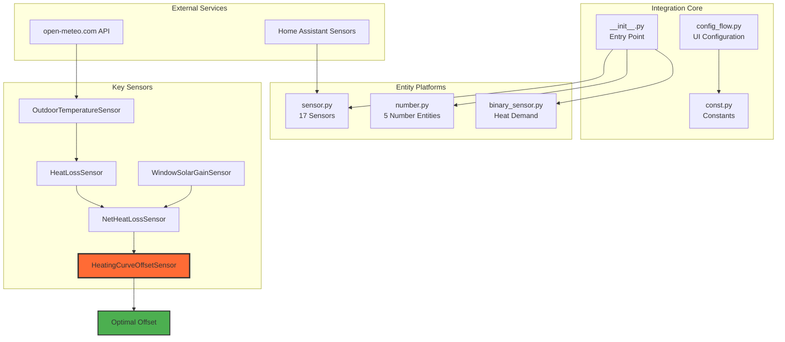
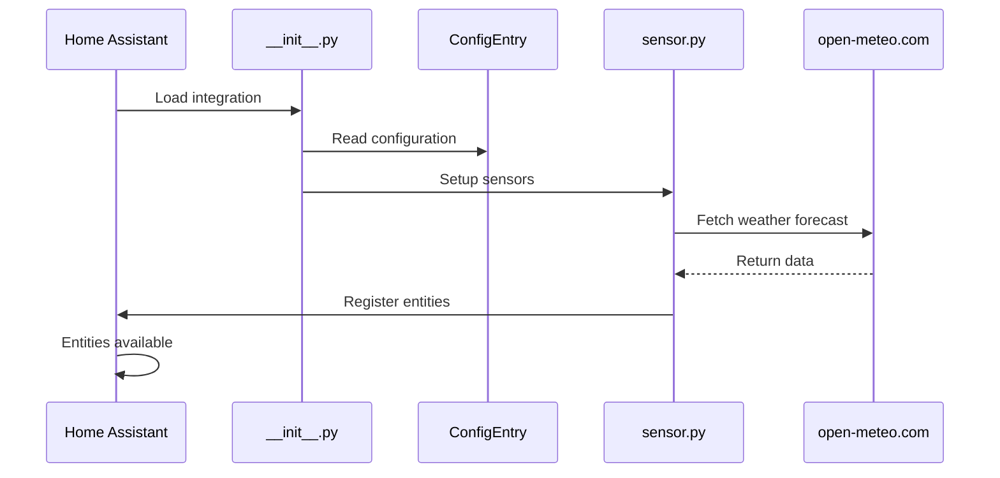
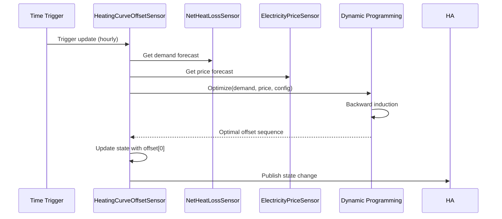

# Architecture Overview

Technical architecture of the Heating Curve Optimizer integration.

## System Architecture



## Component Responsibilities

### `__init__.py` - Integration Setup

**Responsibilities**:
- Register integration with Home Assistant
- Setup config entry
- Initialize platforms (sensor, number, binary_sensor)
- Manage runtime data storage

**Key Functions**:
```python
async def async_setup_entry(hass: HomeAssistant, entry: ConfigEntry) -> bool
async def async_unload_entry(hass: HomeAssistant, entry: ConfigEntry) -> bool
```

### `config_flow.py` - Configuration UI

**Multi-step wizard**:
1. Basic settings (building parameters)
2. Source selection (power sensors)
3. Price settings
4. Validation and completion

**Features**:
- Dynamic sensor discovery
- Field validation
- Options flow for updates

### `sensor.py` - Core Logic (2986 lines)

**17 sensor implementations**:

| Sensor | Dependency | Purpose |
|--------|------------|---------|
| OutdoorTemperatureSensor | API | Weather forecast |
| HeatLossSensor | Outdoor temp | Building heat loss |
| WindowSolarGainSensor | API | Solar heat gain |
| NetHeatLossSensor | Loss + Solar | Actual heat demand |
| **HeatingCurveOffsetSensor** | Net loss + prices | **Core optimizer** |
| ... | | 12 more sensors |

### `number.py` - Manual Controls

**5 number entities** for user override:
- Heating curve offset (-4 to +4°C)
- Min/max supply temperature
- Min/max outdoor temperature

**State synchronization**: Updates stored in `hass.data[DOMAIN]["runtime"]`

### `binary_sensor.py` - Heat Demand Indicator

**HeatDemandBinarySensor**:
- State: ON when net heat loss > 0
- Used for simple automations

## Data Flow

### Initialization Flow



### Optimization Flow



## State Management

### Configuration Storage

**Location**: `hass.data[DOMAIN][entry_id]`

**Contents**:
```python
{
    "area_m2": 150,
    "energy_label": "C",
    "base_cop": 3.5,
    "k_factor": 0.03,
    ...
}
```

### Runtime State

**Location**: `hass.data[DOMAIN]["runtime"]`

**Contents**:
```python
{
    "manual_offset": 0,
    "min_supply_temp": 25,
    "max_supply_temp": 50,
    ...
}
```

**Shared across**: All sensors and number entities

### State Restoration

Sensors implement `RestoreEntity`:
```python
async def async_added_to_hass(self) -> None:
    """Restore previous state."""
    last_state = await self.async_get_last_state()
    if last_state:
        self._attr_native_value = last_state.state
```

## Optimization Algorithm

### Core Implementation

**Location**: `sensor.py:1719-1836`

**Method**: `_optimize_offsets()`

**Algorithm**: Dynamic Programming with backward induction

**State space**:
```python
state = (
    offset,              # -4 to +4 (int)
    buffer,              # 0 to ~20 kWh (float, discretized)
    cumulative_offset    # Running sum (int)
)
```

**DP table**:
```python
dp = {
    (time_step, offset, cum_sum): (
        min_cost,      # Minimum cost-to-go
        parent_state,  # Backpointer for path extraction
        buffer         # Buffer state
    )
}
```

### Computational Complexity

**Time**: O(T × S × A)
- T: Time steps (6)
- S: States per step (~50,000)
- A: Actions per state (~3)

**Space**: O(T × S) for DP table

**Typical runtime**: 0.3-0.8 seconds for 6-hour window

## API Integration

### Weather API (open-meteo.com)

**Endpoints**:
```python
# Temperature forecast
f"https://api.open-meteo.com/v1/forecast"
f"?latitude={lat}&longitude={lon}"
f"&hourly=temperature_2m&forecast_days=2"

# Solar radiation
f"?hourly=shortwave_radiation&forecast_days=2"
```

**Caching**: Responses cached for 5 minutes

**Error handling**: 3 retries with exponential backoff

**Timeout**: 10 seconds

## Event Handling

### State Change Tracking

Sensors subscribe to source entity updates:
```python
self._unsub = async_track_state_change_event(
    hass,
    [entity_id],
    self._handle_state_change
)
```

### Time-Based Updates

```python
async_track_time_interval(
    hass,
    self._async_update_wrapper,
    timedelta(minutes=60)
)
```

## Extension Points

### Adding New Sensors

1. Inherit from `BaseUtilitySensor`
2. Implement `async_update()`
3. Define unique_id and translation_key
4. Add to `async_setup_entry()`

### Modifying Optimization

**Current constraints**:
- Offset range: -4 to +4°C
- Rate limit: ±1°C per time step
- Buffer non-negativity

**To extend**:
- Modify state space in `_optimize_offsets()`
- Update constraint checks
- Adjust DP table structure

### Custom COP Models

Replace quadratic model with custom:
```python
def custom_cop_calculation(self, outdoor_temp, supply_temp):
    """Custom COP model."""
    # Your implementation
    return cop
```

## Performance Considerations

### Optimization

- **Memoization**: DP naturally memoizes subproblems
- **State pruning**: Unreachable states not explored
- **Buffer discretization**: Reduces state space

### Memory

- **Sensor history**: Limited by Home Assistant recorder settings
- **DP table**: Cleared after each optimization
- **Forecast caching**: 24-hour max retention

### Network

- **API calls**: Cached to minimize requests
- **Async operations**: Non-blocking I/O

## Security

### Input Validation

All user inputs validated:
- Range checks on numeric values
- Entity ID existence verification
- Energy label enumeration

### API Security

- HTTPS only for API calls
- No authentication required (public API)
- Rate limiting respected

### State Isolation

Each config entry isolated:
- Separate data namespace
- No cross-contamination

## Testing Architecture

### Test Structure

```
tests/
├── __init__.py
├── test_outdoor_temperature_sensor.py
├── test_heat_loss_sensor.py
├── test_heating_curve_offset_sensor.py  # Critical
└── ... (15 more test files)
```

### Test Patterns

**Fixtures** (pytest):
```python
@pytest.fixture
def hass():
    """Home Assistant instance."""
    return Mock(HomeAssistant)
```

**Async tests**:
```python
@pytest.mark.asyncio
async def test_sensor_update(hass):
    """Test sensor update."""
    ...
```

**Mocking**:
```python
@patch('custom_components.heating_curve_optimizer.sensor.aiohttp')
async def test_api_call(mock_aiohttp, hass):
    ...
```

## Future Architecture Improvements

### Planned

- [ ] Configurable COP models
- [ ] Multi-zone support
- [ ] Machine learning for calibration
- [ ] Historical optimization analysis
- [ ] Integration with demand response programs

### Under Consideration

- [ ] Real-time re-optimization (faster than hourly)
- [ ] Weather forecast ensemble averaging
- [ ] Thermal model sophistication (RC networks)
- [ ] Multi-objective optimization (comfort + cost)

---

For contributing to the architecture, see [Contributing Guide](contributing.md).
