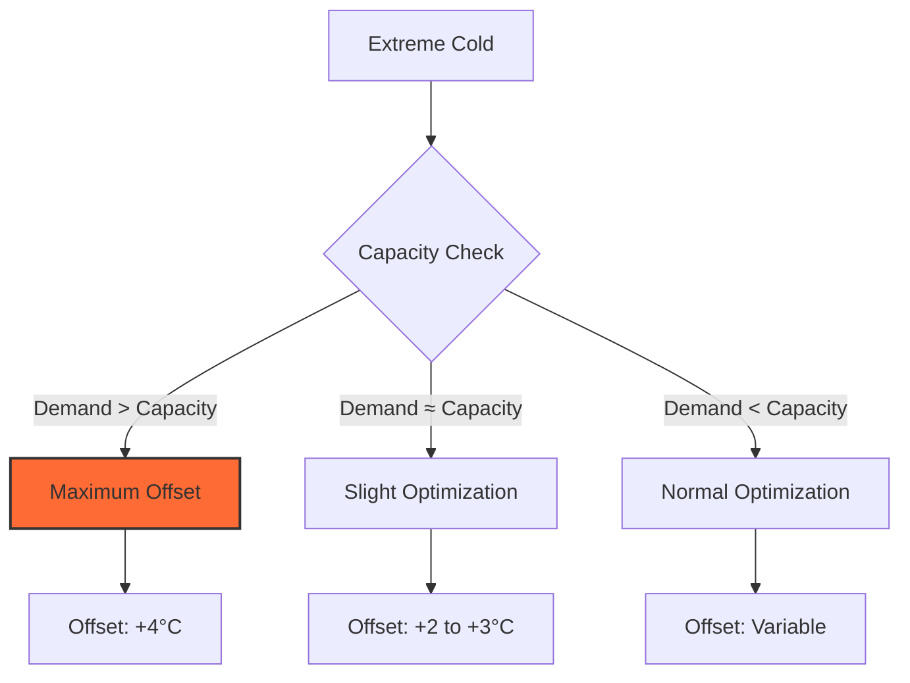

# Example 3: Cold Snap Scenario

This example demonstrates how the optimizer handles extreme cold weather when heating capacity is limited.

## Scenario

**Date**: January 10, 2025
**Location**: Netherlands
**Weather**: Cold snap with temperatures -5°C to 2°C
**Electricity pricing**: Dynamic (Nord Pool)

### Configuration

```yaml
Building:
  Area: 150 m²
  Energy Label: C
  Windows: Standard (20 m² total)

Heat Pump:
  Base COP: 3.5
  K-factor: 0.03
  Max capacity: 12 kW thermal at -5°C outdoor
```

## Challenge: Capacity Limits

During extreme cold, heat demand may approach or exceed heat pump capacity:

\\[
Q_{max} = \text{COP} \times P_{electrical,max}
\\]

At -5°C outdoor, 50°C supply:

- Electrical capacity: 4 kW
- COP: ~2.5 (degraded in cold)
- Thermal capacity: 2.5 × 4 = **10 kW**

But heat loss:

- U-value: 0.8 W/m²K
- Area: 150 m²
- ΔT: 20°C indoor - (-5°C) outdoor = 25°C
- Heat loss: 0.8 × 150 × 25 / 1000 = **3.0 kW** (just base loss)
- With windows and infiltration: **~12 kW total**

**Problem**: Demand ≈ Capacity, limited optimization flexibility!

## Hourly Forecast

| Time | Outdoor | Heat Loss (kW) | Solar Gain (kW) | Net Demand (kW) | Price (€/kWh) |
|------|---------|----------------|-----------------|-----------------|---------------|
| 00:00 | -4°C | 12.0 | 0 | 12.0 | €0.20 |
| 03:00 | -5°C | 12.5 | 0 | 12.5 | €0.18 |
| 06:00 | -5°C | 12.5 | 0 | 12.5 | **€0.15** |
| 09:00 | -3°C | 11.5 | 0.5 | 11.0 | €0.28 |
| 12:00 | 0°C | 10.0 | 1.5 | 8.5 | €0.35 |
| 15:00 | 2°C | 9.0 | 1.0 | 8.0 | €0.30 |
| 18:00 | -1°C | 10.5 | 0 | 10.5 | €0.40 |
| 21:00 | -3°C | 11.5 | 0 | 11.5 | €0.35 |

## Optimization Strategy

### Limited Flexibility

Unlike mild weather examples, cold snaps offer little room for optimization:



### Optimal Offsets

| Time | Net Demand (kW) | Capacity (kW) | Headroom (kW) | Optimal Offset | Rationale |
|------|-----------------|---------------|---------------|----------------|-----------|
| 00:00 | 12.0 | 11.5 | -0.5 | **+4°C** | At capacity, max output needed |
| 03:00 | 12.5 | 11.0 | -1.5 | **+4°C** | Exceed capacity, emergency mode |
| 06:00 | 12.5 | 11.0 | -1.5 | **+4°C** | Still at limit despite low price |
| 09:00 | 11.0 | 12.5 | +1.5 | **+3°C** | Slight headroom, still high offset |
| 12:00 | 8.5 | 14.0 | +5.5 | **+1°C** | Some flexibility, moderate offset |
| 15:00 | 8.0 | 14.5 | +6.5 | **0°C** | Best flexibility, reduce slightly |
| 18:00 | 10.5 | 13.0 | +2.5 | **+2°C** | Limited room, high price |
| 21:00 | 11.5 | 12.5 | +1.0 | **+3°C** | Cold returns, increase offset |

**Key insight**: Offset stays high (0 to +4°C) throughout the day, with minimal variation.

## Cost Analysis

### Strategy A: Fixed Maximum Offset

Always use +4°C offset:

| Time | Demand (kWh) | COP | Electricity (kWh) | Price | Cost (€) |
|------|--------------|-----|-------------------|-------|----------|
| 00:00 | 12.0 | 2.45 | 4.90 | 0.20 | 0.98 |
| 03:00 | 12.5 | 2.38 | 5.25 | 0.18 | 0.95 |
| 06:00 | 12.5 | 2.38 | 5.25 | 0.15 | 0.79 |
| 09:00 | 11.0 | 2.65 | 4.15 | 0.28 | 1.16 |
| 12:00 | 8.5 | 2.95 | 2.88 | 0.35 | 1.01 |
| 15:00 | 8.0 | 3.08 | 2.60 | 0.30 | 0.78 |
| 18:00 | 10.5 | 2.75 | 3.82 | 0.40 | 1.53 |
| 21:00 | 11.5 | 2.58 | 4.46 | 0.35 | 1.56 |

**Daily total**: 33.31 kWh electricity = **€8.76**

### Strategy B: Optimized (Limited Flexibility)

Use variable offsets within capacity constraints:

| Time | Offset | Demand (kWh) | COP | Electricity (kWh) | Price | Cost (€) |
|------|--------|--------------|-----|-------------------|-------|----------|
| 00:00 | +4°C | 12.0 | 2.45 | 4.90 | 0.20 | 0.98 |
| 03:00 | +4°C | 12.5 | 2.38 | 5.25 | 0.18 | 0.95 |
| 06:00 | +4°C | 12.5 | 2.38 | 5.25 | 0.15 | **0.79** |
| 09:00 | +3°C | 11.0 | 2.72 | 4.04 | 0.28 | 1.13 |
| 12:00 | +1°C | 8.5 | 3.08 | 2.76 | 0.35 | 0.97 |
| 15:00 | 0°C | 8.0 | 3.22 | 2.48 | 0.30 | **0.74** |
| 18:00 | +2°C | 10.5 | 2.88 | 3.65 | 0.40 | 1.46 |
| 21:00 | +3°C | 11.5 | 2.65 | 4.34 | 0.35 | 1.52 |

**Daily total**: 32.67 kWh electricity = **€8.54**

**Cost difference**: €0.22 per day

Much lower than mild weather (where 10-30% is typical).

## Why Limited Optimization?

### 1. Capacity Constraints

At peak demand, offset must be at maximum regardless of price:

```
Cannot reduce heating during expensive periods
because system already at minimum viable output
```

### 2. Low COP in Cold

COP is degraded at low outdoor temperatures:

- At -5°C: COP ≈ 2.4 - 2.7
- At +5°C: COP ≈ 3.3 - 3.8

Lower COP range means less benefit from offset optimization.

### 3. Minimal Solar Gain

Winter solar radiation is low (50-150 W/m² vs 600-800 W/m² in spring):

- Little solar gain to create buffer
- No buffering opportunities

## Capacity Warning System

The integration detects when approaching capacity:

```python
if heat_demand > 0.9 * heat_capacity:
    _LOGGER.warning(
        "Heat demand (%.1f kW) approaching capacity (%.1f kW). "
        "Optimization limited.",
        heat_demand, heat_capacity
    )
```

When this triggers:

- Offset forced to +3 or +4°C
- Buffer system disabled (no capacity to build buffer)
- Price optimization takes back seat to meeting demand

## User Experience During Cold Snaps

### What to Expect

1. **High electricity costs**: Inevitable, heat demand is high
2. **Minimal offset variation**: Stays at +3 to +4°C most of the time
3. **Low buffer**: Zero or near-zero throughout
4. **Limited cost reduction**: Much less than in mild weather

### Warning Signs

!!! danger "Insufficient Capacity"
    If you see:

    - Indoor temperature dropping
    - Offset at +4°C continuously
    - Supply temperature at maximum
    - COP below 2.5

    Your heat pump may be **undersized** for the building in extreme cold.

    **Actions**:

    - Improve insulation (long-term)
    - Add supplementary heating (short-term)
    - Reduce indoor setpoint temporarily

### Emergency Mode

If heat pump truly cannot meet demand:

1. **Integration response**:
   - Offset: +4°C (maximum)
   - Warning logged every hour
   - Diagnostics flag: `capacity_exceeded`

2. **User actions**:
   - Lower indoor setpoint (20°C → 18°C)
   - Close unused rooms
   - Use temporary electric heaters in critical areas
   - Check for air leaks

## Optimization Still Helps

Even with limited flexibility, optimization provides benefits:

### 1. COP Efficiency

During warmer parts of day (12:00-15:00), lowering offset improves COP:

- Offset +4°C: COP 2.95, electricity 2.88 kWh
- Offset +1°C: COP 3.08, electricity 2.76 kWh
- **Energy difference**: 0.12 kWh

### 2. Avoiding Excess

Without optimization, system might over-heat during less cold periods:

- Fixed +4°C when only +2°C needed
- Wastes electricity maintaining too-high temperatures
- Integration prevents this

### 3. Predictive Capacity Planning

Integration forecasts capacity shortfalls:

```yaml
attributes:
  capacity_shortfall_forecast: [0, 0, 1.5, 0.8, 0, 0]  # kW
  hours_at_capacity: 4
```

User can proactively adjust expectations or take action.

## Recommendations for Cold Climates

### 1. Right-Size Heat Pump

Heat pump should handle:

\\[
P_{thermal} \geq Q_{loss,design} \times 1.2
\\]

Where design heat loss is at coldest expected outdoor temperature (e.g., -10°C for Netherlands).

### 2. Optimize Building First

Better insulation reduces heat loss:

- Upgrade to A or B energy label
- Better windows (U < 1.0 W/m²K)
- Seal air leaks

**Impact**: Heat loss drops 30-50%, increasing optimization headroom

### 3. Supplementary Heating

During extreme cold (<-5°C outdoor):

- Electric radiators in key rooms
- Reduces load on heat pump
- Allows optimization to resume

### 4. Realistic Expectations

During cold snaps:

- ✅ Expect high electricity costs (physics!)
- ✅ Expect minimal optimization benefit (2-5%)
- ✅ Focus on COP efficiency, not price timing
- ❌ Don't expect high cost reductions (limited opportunities at capacity)

## Comparison: Cold vs Mild Weather

| Metric | Cold Snap (-5°C) | Mild Weather (5°C) |
|--------|------------------|-------------------|
| Heat demand | 11-12 kW | 4-7 kW |
| COP range | 2.4-3.0 | 3.5-4.0 |
| Offset range | +2 to +4°C | -4 to +4°C |
| Buffer accumulation | None | 0-6 kWh |
| Optimization effectiveness | Very limited | Much higher |
| Primary strategy | COP efficiency | Price timing + COP |

---

**Next Example**: [Mixed Conditions](mixed-conditions.md) - Varied weather with multiple optimization opportunities
