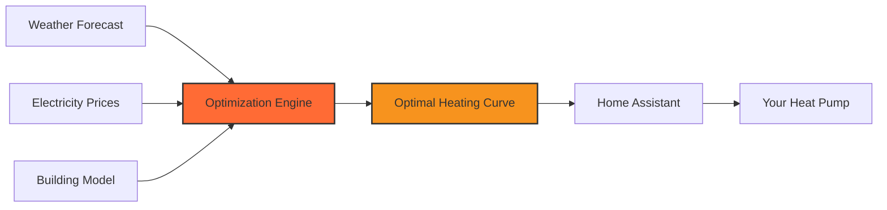
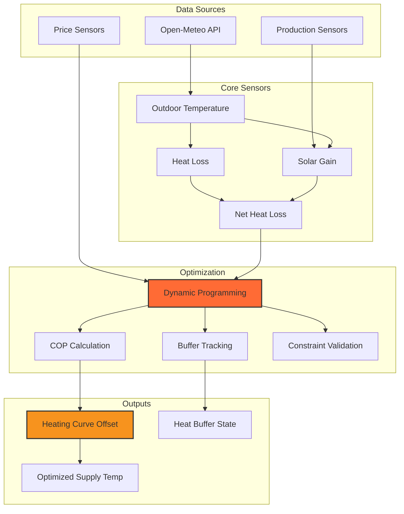

# Heating Curve Optimizer

  <h3>Intelligent Heating Optimization for Home Assistant</h3>
  
Minimize electricity costs while maximizing comfort using dynamic programming and predictive algorithms

---

## What is Heating Curve Optimizer?

**Heating Curve Optimizer** is a sophisticated Home Assistant custom integration that automatically adjusts your heating system to minimize electricity costs while maintaining optimal comfort. It uses advanced algorithms to predict and optimize heating based on:

- :material-weather-partly-cloudy: **Weather Forecasts** - Temperature and solar radiation predictions
- :material-currency-usd: **Electricity Prices** - Dynamic pricing for consumption and production
- :material-heat-pump: **Heat Pump Efficiency** - Real-time COP (Coefficient of Performance) calculations
- :material-home-analytics: **Building Characteristics** - Your home's thermal properties

## Key Features

### :chart_with_upwards_trend: Cost Optimization
Dynamically adjust heating curves to minimize electricity costs while meeting heat demand. The optimizer shifts heating load to periods with lower electricity prices when possible.

### :sunny: Solar Integration
Automatically accounts for solar gain through windows and solar production, creating a thermal buffer that reduces heating requirements.

### :brain: Smart Predictions
Uses a 6-hour planning horizon with dynamic programming to find the optimal heating strategy considering:
- Variable electricity prices
- Weather forecast (temperature, solar radiation)
- Heat pump efficiency curves
- Building thermal mass

### :thermometer: Comfort Constraints
Maintains supply temperature within configurable limits while respecting maximum rate-of-change constraints to prevent system stress.

## How It Works

The integration continuously:

1. **Fetches** weather forecasts and electricity price predictions
2. **Calculates** heat demand based on your building's thermal properties
3. **Optimizes** heating curve offsets using dynamic programming
4. **Outputs** optimal supply temperature adjustments
5. **Adapts** in real-time as conditions change

## Quick Start

Get started in minutes:

1. **Install** via HACS (Home Assistant Community Store)
2. **Configure** your building parameters (area, energy label, window sizes)
3. **Connect** your electricity price sensors
4. **Deploy** and enjoy automated optimization!

[Get Started](installation.md){ .md-button .md-button--primary }
[View Examples](examples/price-optimization.md){ .md-button }

## Architecture Overview

## What Makes It Special?

### Dynamic Programming Approach
Unlike simple threshold-based heating controls, this integration uses **dynamic programming** to solve the multi-period optimization problem. This means it considers:

- Future electricity prices
- Predicted weather changes
- Heat pump efficiency variations
- Building thermal inertia

The result is a globally optimal heating strategy, not just locally optimal decisions.

### Real Physics Modeling
The integration uses actual thermal engineering principles:

- **Heat Loss**: $Q_{loss} = U \times A \times \Delta T$
- **Solar Gain**: Based on radiation intensity and window orientation
- **COP Modeling**: $COP = (COP_{base} + \alpha \times T_{outdoor} - k \times (T_{supply} - 35)) \times f$

This ensures realistic predictions and reliable optimization.

### Production-Aware Optimization
When you have solar panels or other production:

- Negative net prices are handled correctly
- Thermal buffer is created from excess solar gain
- Optimization prefers heating during production peaks

## Supported Configurations

- :white_check_mark: Air-to-water heat pumps
- :white_check_mark: Ground-source heat pumps
- :white_check_mark: Hybrid heating systems
- :white_check_mark: Dynamic electricity pricing
- :white_check_mark: Fixed electricity pricing
- :white_check_mark: Solar production integration
- :white_check_mark: Multi-zone buildings (with appropriate configuration)

## Documentation Structure

- **[Getting Started](installation.md)** - Installation and initial setup
- **[Algorithm](algorithm/overview.md)** - Deep dive into the optimization engine
- **[Examples](examples/price-optimization.md)** - Real-world scenarios with visualizations
- **[Reference](reference/sensors.md)** - Complete sensor and configuration reference
- **[Development](development/contributing.md)** - Contribute to the project

## Community & Support

- :material-github: **GitHub**: [Report issues](https://github.com/bvweerd/heating_curve_optimizer/issues)
- :material-home-assistant: **Home Assistant Community**: Share your experiences
- :material-coffee: **Buy me a coffee**: Support development

---

  
<em>Built with ❤️ for the Home Assistant community</em>

